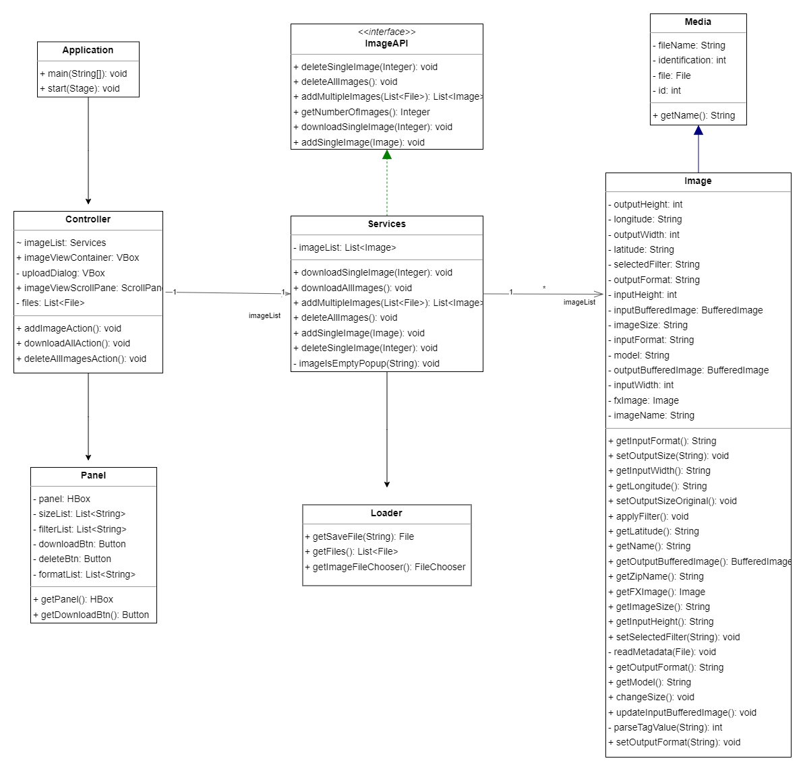
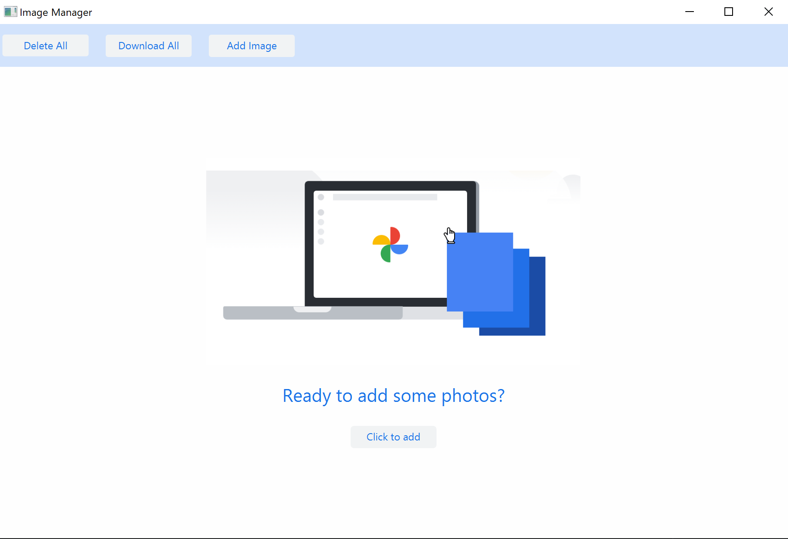
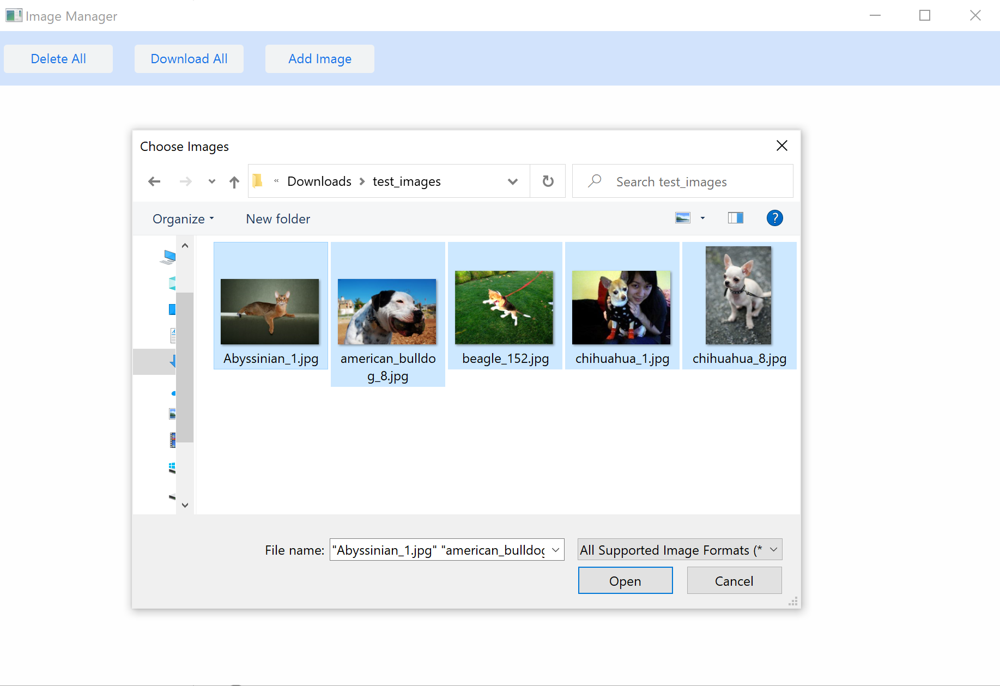
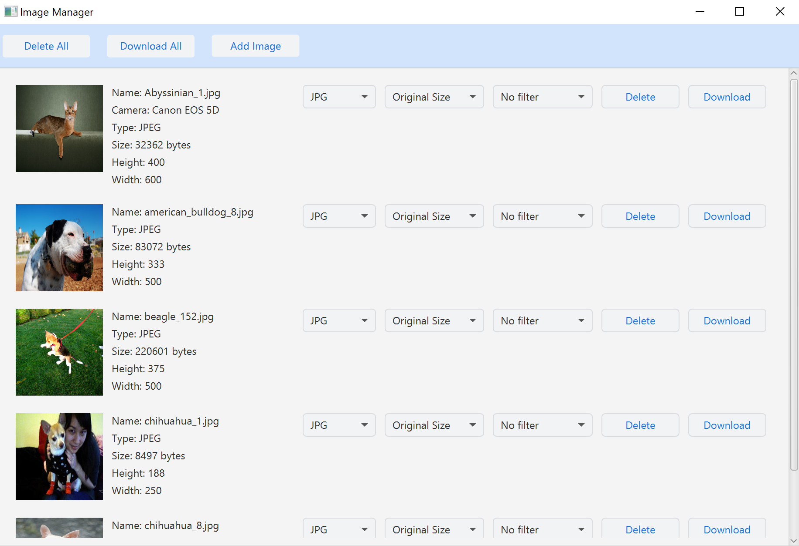
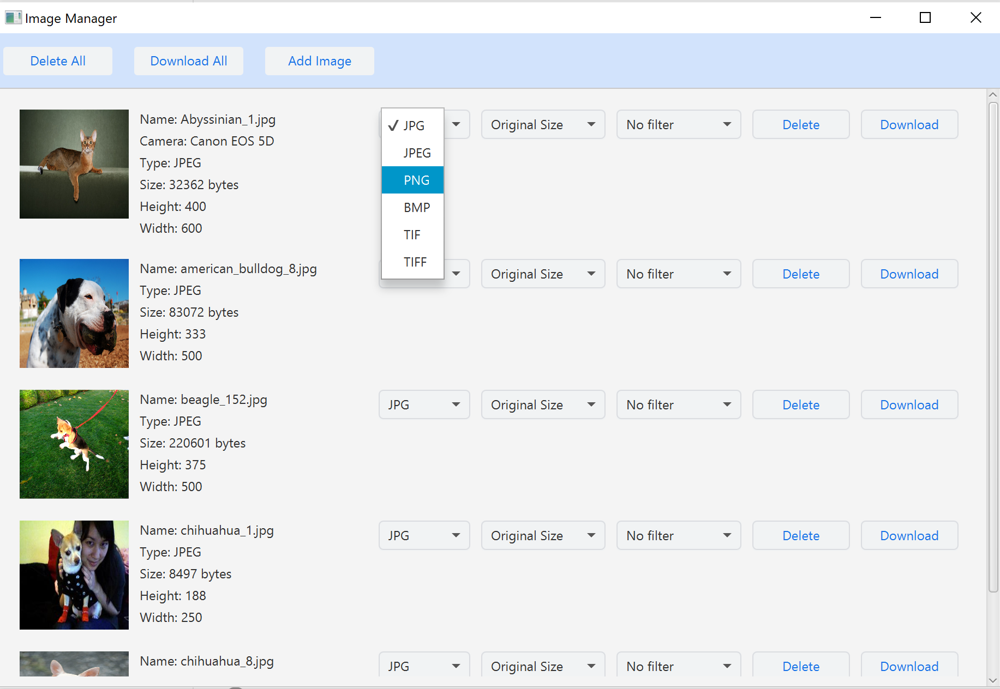
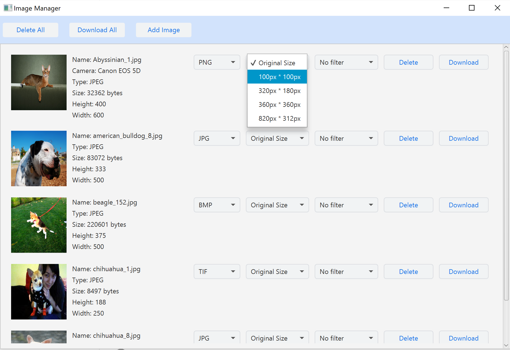
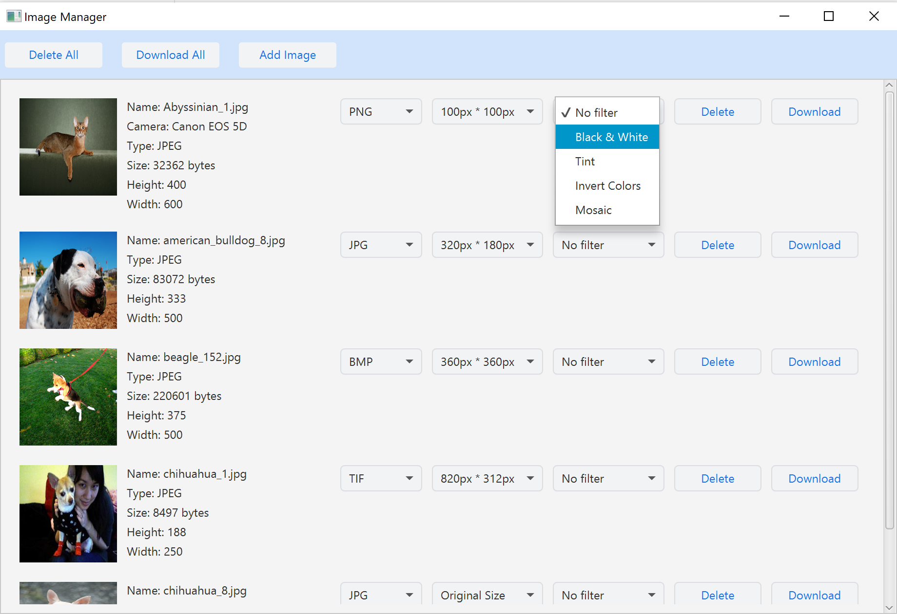
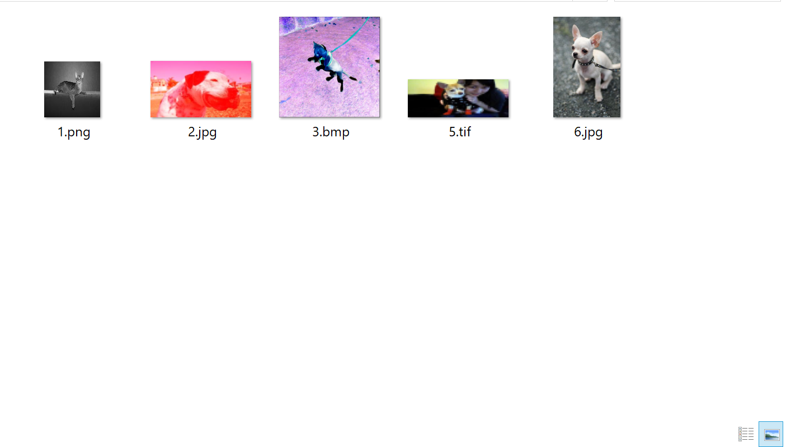

# Image Manager

This is a JavaFX-based GUI application for managing and converting image files. The application allows users to upload image files from their desktop/laptop, view image thumbnails, and apply various filters to the images. The application also supports conversion of images to various formats, and provides image properties such as height, width, camera, and location.

# Contributor
Tianxiang Ren

# Project Structure

```
Image_Manager/
├── lib/
├── src/
│   └── main/
│       ├── java/
│       │   ├── module-info.java
│       │   └── com.example.imagemanager/
│       │       ├── Application.java
│       │       ├── Controller.java
│       │       └── componets/
│       │           ├── Image.java
│       │           ├── ImageAPI.java
│       │           ├── Loader.java
│       │           ├── Media.java
│       │           ├── Panel.java
│       │           └── Services.java
│       └── resources/
│           └── com.example.imagemanager/
│               ├── images/
│               └── view.fxml
├── target/
├── pom.xml
└── README.md
```

- `Image_Manager`: the name of the project

- `lib`: the directory for any external libraries used in the project

- `src`: the source code directory

- `src/main`: the directory for the main application code

- `src/main/java`: the directory for the Java source code files

- `module-info.java`: the module descriptor file for JDK 9 and later

- `com.example.imagemanager`: a package name that follows the reverse domain name convention

- `Application.java`: the main class of the application

- `Controller.java`: a class for controlling the application's behavior

- `components`: a package containing various components used in the application

- `Image.java`: a class for modifying image properties such as size, filter, and format

- `ImageAPI.java`: a class containing all the interfaces for image management

- `Loader.java`: a class for loading images

- `Media.java`: a parent class of `Image.java`

- `Panel.java`: a class for generating the panel after uploading all the images

- `Services.java`: a class that implements all the interfaces declared in `ImageAPI.java`, including download, delete, and save images

- `src/main/resources`: the directory for any non-Java source files, such as configuration files

- `images.jpg`: images used in the project

- `view.fxml`: a JavaFX file generated by the Scene Builder

- `target`: the directory for the compiled code and other build artifacts

- `pom.xml`: the project object model file for Maven-based projects

- `README.md`: this file

This project follows the Model-View-Controller (MVC) design pattern, in which the `Model` represents the data and business logic, the `View` represents the user interface, and the `Controller` acts as an intermediary between the `Model` and the `View`. The `Model` is implemented in classes such as `Image.java`, `ImageAPI.java`, and `Services.java`, the `View` is implemented in the `view.fxml` and `Panel.java`, and the `Controller` is implemented in the `Controller.java` file.

# Class Diagram

<br>

# Usage

To use the application, follow these steps:

1. Launch the application by running the `Application.java` class.
   
   <br>

2. Click the "Add image" button to select single or multiple image files from your desktop/laptop.
   
   <br>

3. The application will display a thumbnail of the uploaded images, along with its properties on the generated panel.
   
   <br>

4. Use the "Format" choice box to select the desired image format(s) for conversion.
   
   <br>

5. Use the "Resize" choice box to select the desired image size(s) for conversion.
   
   <br>

6. Use the "Apply Filter" choice box to apply various filters to the image.
   
   <br>

7. Use the "Download" or "Download All" button to download the converted image(s).
   
   <br>

8. Downloaded images in the different format / size / filter after conversion.
   
   <br>

# License

This project is licensed under the MIT License - see the `LICENSE` file for details.
